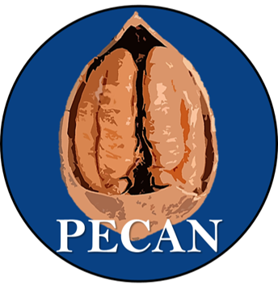

  

## Addressing Early Carrer Academic Needs

Before PECAN was founded, interviews and online consultations were conducted by Paul Garrett to identify ECA needs and concerns within the School of Psychological Sciences. Past and current ECAs were asked what issues affected them most, both as a young academic and in light of the recent COVID-19 pandemic. Upon examining ECA responses, it became clear that many issues - feeling isolated, lacking academic resources, being unaware of career oppertunities, lacking career milestones, wishing to raise their concerns with annonymity - could be resolved through a peer-to-peer support network that worked with the School of Psychological Sciences. To these ends, PECAN was formed.

PECAN aims to be a constructive part of the Academic hierarchy. Below we list the internal aims of PECAN as an oganization, and the external aims we have for PECAN as part of the School of Psychological Sciences. These aims are in direct response to the ECA needs and issues identified at the founding of PECAN. In addressing these aims, we think ECAs will be more supported within the School, will be more active members of the school, and will be more likely to go onto innovative research, teaching and industry careers.

## Internal PECAN Aims
- PECAN aims to bring ECAs together in person and online, support incoming ECAs with a community and academic resources, and recognize the achievements of outgoing ECAs.

- PECAN provides ECAs a means of seeking peer support, advice and mentorship, and a way to learn from the expereinces of other ECAs within the school.

- PECAN will provide a school-based point of contact that can answer questions related to ECA research, teaching as an ECA, living and working in Melbourne, and building a social network within and outside of the university. 

- PECAN will work to ensure that relevant faculty resources - workshops, grants, committee oppertunities, information from the Early Career Researcher Network - are easily accessible to to MSPS ECAs.

- PECAN will curate a list of grants and awards for ECAs to apply for within and outside of the school. 

- PECAN will create a repository of past award and grant applications so ECRs can learn from their peers and school mentors. It is important that these represent both successful and non-successful applications. Knowing why an application wasn't successful is just as important as knowing why another was supported.

- PECAN will create a resource of ECA outreach options to promote ECAs and their work. This will include news outlets such as the UoM Media Newsteam, Melboure University's Pursuit, their internal Hub News Series, and larger academic news outlets such as The Conversation.

## PECAN School, Hub and Committee Aims
- PECAN will provide a centralise point of information sharing, allowing ECAs to stay up-to-date with decisions made by School Committees, the Hubs, the Faculty, and external networks such as the Early Career Researcher Network.

- PECAN aims to ensure ECA representatives can volunteer in key committees, and requests that committees ask for an update by their ECA representatives. Leadership oppertunities are a key component of many grant and job applications. ECAs are intentionally not included on committees to protect their research and teaching time, however, voluntary ECA positions could be made available on key committees to ensure leadership opportunities and information sharing among PECAN. 

- PECAN aims to work with the school and faculty to provide career milestones for its members and the means of achieving these milestones. ECAs predominantly seek career advice from their supervisors, however, this advice may be based on out-of-date experience. Grant and job requirements are updated yearly and ECAs need to know what to prioritize - public outreach, publications, teaching, leadership, awards - to succeed in today's job market and/or grant systems. 

- PECAN aims to ensure ECAs are aware of guest lecturing oppertunities when they arise, and what courses may require guest lecturing positions. When applying for continuing contracts ECAs often need to show lecturing experience, this is one way the School and PECAN can facilitate one-another.

- PECAN will provide a means of raising ECA issues and advocating for ECA concerns annonymously within the school. ECAs often work on short and insecure contracts, and relatively few ECAs exist within the school, making it difficult for individuals to raise their concerns at school and hub meetings without feeling singled-out. PECAN can raise ECA concerns as a colletive body that ensures its member's anonymity.

- PECAN aims to ensure ECAs know how to interact with their Hubs productively and work with the Hubs to provide oppertunities that benefit both ECAs and the School at large. ECAs could interact with hubs more productively in two capcities: leadership roles and collaborations:

- Leadership roles: ECAs may advance their leadership, teaching, and career-building by running voluntary hub workshops (in their own, and in other hubs). This would also make ECAs accessible to Ph.D. and future Ph.D. students, affording opportunities for mentorship or future supervision.

- Collaborations: ECAs may form ECA-led collaborations that use the resources from one or more Hubs collaboratively. Although Snr Academics would be welcome on these projects, it would be good for ECAs to have an opportunity to perform independently led projects to showcase academic leadership qualities.

<!-- 
Original list of issues identified by PECAN ECAs

## PECAN Networking Issues
ECAs do not have a means of contacting one another, cannot easily identify who other ECAs are, and are not notified when ECAs enter or leave the school. 

- ECAs cannot easily connect with other peers, limiting their ability to seek advice, mentorship, or hear about the experiences of other ECAs.

- ECAs entering MSPS do not have a school-based point of contact that can answer questions related to conducting research or teaching in the school as an ECA, living and working in Melbourne, and building social networks within and outside of the university. 

- There are ECA resources provided by the Faculty that could be accessed if they were made available in a space MSPS ECAs know to access. 

- ECAs often pursue similar career goals, such as grants and awards, however, do not have a readily accessible collection of resources and materials from which to learn. This disadvantages ECAs who don’t have an established peer network from which to request such materials. These resources could be volunteered and made available (anonymously, if required) in a centralized repository accessible by all ECAs, increasing the likelihood of ECAs achieving career milestones, such as obtaining grants and awards.

## School and PECAN issues

- ECAs do not have a centralized point of information sharing. Therefore, decisions made by committees, schools, the Faculty, and external networks such as the Early Career Researcher Network, cannot be easily communicated.

- ECAs are among the most unlikely to voice their concerns at school or hub meetings. Their contracts are often short and insecure. Furthermore, with relatively few ECAs present in the school, ECAs lack anonymity in raising their concerns and could benefit from a collective body that ensures their anonymity while still having their voices heard. 

- ECAs predominantly seek career advice from their supervisors. However, supervisors may be providing advice based on out-of-date experience. With grant and job requirements updated almost yearly, ECAs need to know what to prioritize (e.g., public outreach, teaching) to succeed in today’s job market and/or grant systems, and the school needs to support ECAs in meeting these requirements.

## School, Hub, and Committee issues
- ECAs often need to show teaching experience, specifically lecturing experience, when applying for continuing contracts. Guest lecturing is the best way to gain this experience. However, guest lecturing from ECA’s is not prioritized in MSPS courses.

- Job descriptions for ECAs generally allocate 100% of their time to research or teaching roles. ECAs are intentionally not included on committees to protect this time, however, this decision may harm their ability to show leadership skills when going for future jobs and grants. ECA time must remain protected, however, voluntary ECA positions could be made available on key committees to ensure leadership opportunities and information sharing among PECAN. 

- ECAs interact with and receive support from their respective Hubs to differing degrees, with many not knowing how to interact with their hubs productively. ECAs could interact with hubs more effectively in two capacities: leadership roles & collaborations.

- Leadership roles: ECAs may advance their leadership, teaching, and career-building by running voluntary hub workshops (in their own, and in other hubs). This would also make ECAs accessible to Ph.D. and future Ph.D. students, affording opportunities for mentorship or future supervision.

- Collaborations: ECAs may form ECA-led collaborations that use the resources from one or more Hubs collaboratively. Although Snr Academics would be welcome on these projects, it would be good for ECAs to have an opportunity to perform independently led projects to showcase academic leadership qualities.

-->