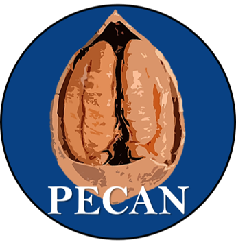

  

## Teaching Tools

## Cloud Storage Options

###Git-Hub and Bitbucket

### Dropbox

### OneDrive

###

## Referencing Tools
Menderlay, Bibtex, Endnote, others? (I don't use these and need help filling in these gaps).

## Meta Analysis and Systematic Review Tools
I also don't use these but should find out what they are.

## Writing Tools
### Overleaf (LaTeX)
Writing isn't easy and staying motivated can be hard. Although writing processes like Microsoft Word are often the default among academics, modern alternatives eixst that help you write quickly and format documents to Journal Specifications. Prime among these is Overleaf, a LaTeX scripting language that formats your document (page layout, citation style, title page, heading styles, figure placements) to a Journal's specifications all through a few simple commands. If you find LaTeX source code intimidating, Overleaf also has a Rich Text Editor (like Microsoft Word) to make transitioning to LaTeX just that bit easier. Overleaf is free to use, and if you signin using your university staff email, you will have access to all of its paid-for features, such as track changes, commenting, and git-hub integration.

### Google docs

## Analysis Tools

### JASP

### SPSS

### JAMOVI

### JAGS/BUGS

## Coding Tools
Find tools that help you learn coding langauges that are needed in Academic and industy jobs. Key languages include Python, Matlab, R, C and C++, and Javascript.

### Python

### Matlab

### Rstudio

#### Rmarkdown

#### WorkflowR

### Javascript

### C and C++

## Personal Sites
Design your own webpage where you can host links to your projects, papers, code, teaching resources, CV and awards. Make it easy for potential employers to see why they should hire you.

### Mkdocs
[Mkdocs](https://www.mkdocs.org/) (pronounced makedocs) is a free static-site builder which offers various customisable themes for you to make your webpage for free. Mkdocs is usually used to build wiki-like pages for internal use in companies or for open-access repositories, however, it can easily be used to build a static personalized site - for example, PECAN! Learn how to build a site with [Mkdocs](https://www.mkdocs.org/) and host your site through git-hub for free.

